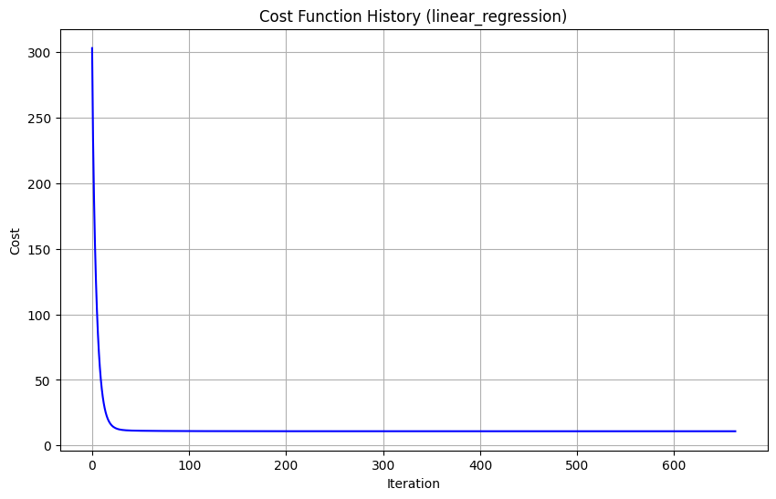
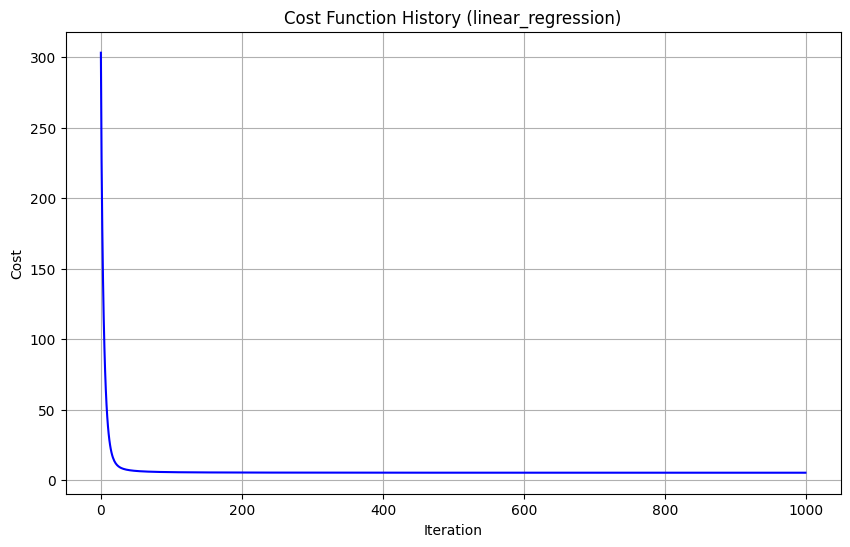
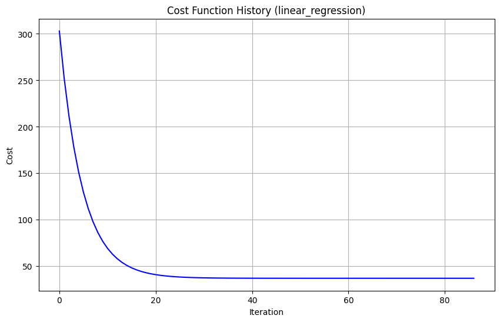

# 线性回归模型训练与评估实验报告

本实验中，实验手册给出的代码中 `data = pd.read_csv('housing.data', delim_whitespace=True, header=None)`的使用会出现报错，`FutureWarning: The 'delim_whitespace' keyword in pd.read_csv is deprecated and will be removed in a future version. Use ``sep='\s+'`` instead`
因此，我将此代码替换成`data = pd.read_csv('housing.data', sep=r'\s+', header=None)`，从而解决了此问题

## 实验环境
- 本机语言环境：Python 3.12
- 使用库函数:
  - NumPy: 用于进行数值计算和数组操作。
  - Matplotlib: 用于数据可视化，绘制图表。
  - Pandas: 用于数据处理和读取 CSV 文件。
- 实验数据
本实验使用经典的 Boston Housing 数据集。该数据集包含波士顿郊区的房屋信息以及房价中位数。

## 实验步骤

#### 1.导入必要库函数


```python
import numpy as np
import matplotlib.pyplot as plt
import pandas as pd
```

这部分代码导入了实验所需的 NumPy、Matplotlib 和 Pandas 库，并分别使用别名 np、plt 和 pd 方便后续调用。


#### 2.加载和查看数据


```python
data = pd.read_csv('housing.data', sep=r'\s+', header=None)
print(data.shape)
```

    (506, 14)
    

#### 3.准备特征和目标变量


```python
X = data.iloc[:, :-1].values  # 所有行，除了最后一列作为特征
y = data.iloc[:, -1].values.reshape(-1, 1)  # 所有行，最后一列作为目标，并重塑为列向量
```

这里，使用 Pandas 的 iloc 方法选取数据。X 包含了所有行和除了最后一列的所有列（即特征），.values 将 Pandas DataFrame 转换为 NumPy 数组。y 选择了所有行的最后一列（即目标变量），并使用 reshape(-1, 1) 将其转换为一个列向量，这在后续的矩阵运算中是必要的。

#### 4.特征标准化


```python
def normalize_features(X):
    mean = np.mean(X, axis=0)
    std = np.std(X, axis=0)
    X_normalized = (X - mean) / std
    return X_normalized, mean, std

X_normalized, X_mean, X_std = normalize_features(X)
```

normalize_features 函数实现了特征标准化。对于每个特征，它计算均值和标准差，然后通过减去均值并除以标准差来对特征进行标准化。标准化后的数据具有零均值和单位方差，这有助于梯度下降算法更快地收敛。函数返回标准化后的特征矩阵以及原始数据的均值和标准差，以便在预测时对新数据进行相同的标准化。

#### 5.划分训练集和测试集


```python
def train_test_split(X, y, test_size=0.2, random_state=None):
    if random_state:
        np.random.seed(random_state)
    m = X.shape[0]
    indices = np.random.permutation(m)
    test_indices = indices[:int(m * test_size)]
    train_indices = indices[int(m * test_size):]
    return X[train_indices], X[test_indices], y[train_indices], y[test_indices]

X_train, X_test, y_train, y_test = train_test_split(
    X_normalized, y, test_size=0.2, random_state=42
)
```

`train_test_split` 函数将数据集划分为训练集和测试集。`test_size=0.2` 表示将 20% 的数据用于测试，80% 的数据用于训练。`random_state=42` 设置随机种子，确保每次运行代码时数据集的划分方式相同，从而保证实验的可重复性。函数返回划分后的训练集特征 `X_train`、测试集特征 `X_test`、训练集目标 `y_train` 和测试集目标 `y_test`。这里我们对标准化后的特征 `X_normalized` 进行划分。

#### 6.训练回归模型

##### 模型训练函数


```python
def normal_equation(X, y):
    # 一个trick，添加偏置项 (x0=1)，以便学习β_0
    X_hat = np.c_[np.ones((X.shape[0], 1)), X]
    # 正规方程公式: theta = (X^T * X)^(-1) * X^T * y
    beta_best = np.linalg.inv(X_hat.T.dot(X_hat)).dot(X_hat.T).dot(y)
    return beta_best
```

 - 使用正规方程（Normal Equation）求解线性回归模型参数
 - 参数:
    - X : 特征矩阵 (m, n)
    - y : 标签向量 (m, 1)
 - 返回:
    - beta_best : 最优参数 (n + 1, 1)


```python
def gradient_descent(X, y, beta, learning_rate, iterations, tol=1e-6):
    # 添加偏置项
    X_hat = np.c_[np.ones((X.shape[0], 1)), X]
    m = X.shape[0]
    losses = []

    for i in range(iterations):
        # 前向传播计算预测值和误差
        y_pred = X_hat.dot(beta)
        error = y_pred - y

        # 计算损失 (MSE)
        loss = (1 / (2 * m)) * np.sum(error ** 2)
        losses.append(loss)

        # 检查收敛
        if i > 0 and abs(losses[-2] - losses[-1]) < tol:
            print(f"Converged at iteration {i}")
            break

        # 反向传播计算梯度
        grad = (1 / m) * X_hat.T.dot(error)

        # 参数更新
        beta = beta - learning_rate * grad

    return beta, losses
```

- 使用梯度下降法训练线性回归模型（合并梯度计算和训练过程）
- 参数:
    - X : 特征矩阵 (m, n)
   -  y : 标签向量 (m, 1)
   -  beta : 初始化的参数向量 (n+1, 1)
   -  learning_rate : 学习率
   -  iterations : 最大迭代次数
   -  tol : 收敛阈值
- 返回:
   -  beta : 训练后的参数向量
   -losses : 损失值记录列表


```python
def initialize_beta(n, method="random"):

    if method == "zero":
        beta = np.zeros((n + 1, 1))
    elif method == "random":
        beta = np.random.rand(n + 1, 1) * 0.01
    elif method == "xavier":
        scale = np.sqrt(2 / (n + 1))
        beta = np.random.randn(n + 1, 1) * scale
    else:
        raise ValueError("Unknown initialization method")
    return beta
```

    初始化线性回归参数 beta
    参数:
    n : 特征数量 (不含偏置项)
    method : 初始化方式 ("zero", "random", "xavier")


```python
def linear_regression(X, y, learning_rate=1.0, iterations=256,
                      method="gradient_descent"):
    m, n = X.shape
    beta = initialize_beta(n)

    if method == "gradient_descent":
        return gradient_descent(X, y, beta, learning_rate, iterations)
    elif method == "linear":
        return normal_equation(X, y)
    else:
        raise ValueError("Unknown solver %s method" % method)
```

##### 训练模型


```python
    beta, losses = linear_regression(
        X_train, y_train, learning_rate=0.1, iterations=1000,
        method="gradient_descent"
    )
```

    Converged at iteration 663
    

#### 7.绘制损失函数曲线


```python
def plot_cost_history(cost_history, method_name):
    """绘制损失函数曲线"""
    plt.figure(figsize=(10, 6))
    plt.plot(range(len(cost_history)), cost_history, 'b-')
    plt.xlabel('Iteration')
    plt.ylabel('Cost')
    plt.title(f'Cost Function History ({method_name})')
    plt.grid(True)
    plt.show()

plot_cost_history(losses, 'linear_regression')
```


    

    


plot_cost_history 函数用于可视化损失函数在训练过程中的变化。它绘制了迭代次数与损失值的折线图，帮助我们观察梯度下降算法的收敛情况。如果曲线呈现下降趋势并逐渐趋于平缓，则表明模型正在学习。

#### 8.预测测试集


```python
def predict(X, beta):
    X_hat = np.c_[np.ones((X.shape[0], 1)), X]
    y_hat = X_hat.dot(beta)
    return y_hat

y_pred = predict(X_test, beta)
```

#### 9.评估


```python
#评估指标 (均方误差和R^2分数)
def r2_score(y_true, y_pred):
    ss_res = np.sum((y_true - y_pred) ** 2)
    ss_tot = np.sum((y_true - np.mean(y_true)) ** 2)
    return 1 - (ss_res / ss_tot)

def rmse(y_true, y_pred):
    """
    计算均方根误差 (Root Mean Squared Error, RMSE)

    参数:
    y_true : array-like, 真实值 (实际观测值)
    y_pred : array-like, 预测值 (模型输出值)

    返回:
    float, RMSE值 (与y_true单位一致)
    """
    y_true = np.array(y_true)
    y_pred = np.array(y_pred)
    if len(y_true) != len(y_pred):
        raise ValueError("输入长度不一致！")
    mse = np.mean((y_true - y_pred) ** 2)
    return np.sqrt(mse)
```


```python
# 评估
print("R^2 Score:", r2_score(y_test, y_pred))
print("RMSE Score:", rmse(y_test, y_pred))

# 经过训练后的参数β
print("Trained coefficients:")
print(beta)
```

    R^2 Score: 0.6703429293147594
    RMSE Score: 4.941086005433479
    Trained coefficients:
    [[22.47708706]
     [-0.96918556]
     [ 0.71102914]
     [ 0.25233562]
     [ 0.70867434]
     [-1.96737952]
     [ 3.1163148 ]
     [-0.16933215]
     [-3.04461922]
     [ 2.27046721]
     [-1.78296948]
     [-1.97426436]
     [ 1.12561167]
     [-3.62618341]]
    

## 实验结果分析

**1. 数据集信息:**

根据代码运行结果的第一行输出 `(506, 14)`，可知本次实验使用的数据集包含 506 个样本，每个样本有 14 个特征。其中，前 13 个特征被用作模型的输入变量（影响房价的因素），第 14 个特征是目标变量（房价）。

**2. 模型训练过程:**

* **收敛迭代次数:** 控制台输出 `Converged at iteration 663` 表明，梯度下降算法在 **第 663 次迭代**时达到了设定的收敛条件。这说明模型在经过一定次数的迭代学习后，损失函数的变化已经非常小，模型参数趋于稳定。
* **损失函数变化:** 观察提供的损失函数历史曲线图（Cost Function History (linear\_regression)），可以得出以下结论：
  1. 初始阶段，损失函数值从一个较高的水平迅速下降，表明模型在初始迭代时能够快速地学习到数据中的主要模式，参数得到了显著的更新。
  2. 随着迭代次数的增加，损失函数下降的速度逐渐减缓，并最终趋于一个相对稳定的较低值。这表示模型逐渐接近最优解，参数的更新幅度减小。
  3. 曲线在后期变得非常平缓，这与控制台输出的收敛信息相吻合，表明模型已经基本收敛到局部最小值。

**3. 模型评估:**
- R² 分数 (决定系数):输出 `R^2 Score: 0.6703429293147594`。R² 分数的取值范围是 [0, 1]，越接近 1 表明模型对目标变量的解释能力越强，拟合效果越好。本次实验得到的 R² 分数为 **0.6703**，这意味着该线性回归模型能够解释约 67.03% 的房价变异性。这个结果表明模型具有一定的预测能力，但仍有提升空间。
- RMSE 分数 (均方根误差): 输出 `RMSE Score: 4.941086005433479`。RMSE 衡量了预测值与真实值之间的平均差异，值越小表示模型的预测精度越高。本次实验得到的 RMSE 为 **4.9411**。由于房价的单位未知，我们需要结合实际房价的范围来评估这个误差的大小。如果房价的数值范围较大，则 4.94 的 RMSE 可能相对较小；反之，如果房价数值范围较小，则这个误差可能相对较大。

**4. 训练后的模型参数:**

输出 `Trained coefficients:` 展示了线性回归模型训练完成后得到的各个特征的系数（权重）以及截距（在代码中作为第一个系数 `22.47708706` 对应于添加的偏置项）。

* **截距 (Bias):** `22.47708706`。当所有特征的值都为 0 时，模型预测的房价约为 22.48。
* **特征系数 (Weights):** 列表中的其余 13 个数值分别对应于 13 个特征的权重。
    * **负系数:** 例如 `-0.96918556` (对应第一个实际特征)、`-1.96737952` (对应第五个实际特征)、`-3.04461922` (对应第七个实际特征) 等，表明这些特征与房价呈负相关关系，即该特征的值增加时，房价趋于降低。
    * **正系数:** 例如 `0.71102914` (对应第二个实际特征)、`3.1163148` (对应第六个实际特征)、`2.27046721` (对应第八个实际特征) 等，表明这些特征与房价呈正相关关系，即该特征的值增加时，房价趋于升高。
    * **系数大小:** 系数的绝对值大小反映了该特征对房价的影响程度。绝对值越大，该特征对房价的影响越大。例如，系数为 `3.1163148` 的特征对房价的影响相对较大。

**5. 总结:**

本次实验成功地使用线性回归模型对房价进行了预测。模型经过 663 次迭代后收敛，损失函数显著下降。在测试集上，模型取得了 R² 分数约为 0.67，RMSE 约为 4.94。


## 补充实验——过拟合现象


```python
# 读取数据
data = pd.read_csv('housing.data', sep=r'\s+', header=None)
# 查看前几行
print(data.shape)

# 准备特征
X = data.iloc[:, :-1].values  # 所有行，除最后一列
y = data.iloc[:, -1].values.reshape(-1, 1)  # 所有行，最后一列

noise = np.random.randn(X.shape[0], 200)  # 添加200列随机噪声特征
X_augmented = np.hstack([X, noise])

# 标准化特征
X_normalized, X_mean, X_std = normalize_features(X_augmented)

# 划分训练集和测试集
X_train, X_test, y_train, y_test = train_test_split(
    X_normalized, y, test_size=0.2, random_state=42
)

# 训练模型
beta, losses = linear_regression(
    X_train, y_train,
    learning_rate=0.1,
    iterations=1000
)

# 绘制损失函数曲线
plot_cost_history(losses, 'linear_regression')

# 预测测试集
y_pred = predict(X_test, beta)

# 评估
print("test R² Score:", r2_score(y_test, y_pred))
print("test RMSE Score:", rmse(y_test, y_pred))
print("train R² Score:", r2_score(y_train, predict(X_train, beta)))
print("train RMSE Score:", rmse(y_train, predict(X_train, beta)))
# 经过训练后的参数β
print("Trained coefficients:")
print(beta)
```

    (506, 14)
    


    

    


    test R² Score: 0.28695569219431427
    test RMSE Score: 7.266904861033072
    train R² Score: 0.8768902281512945
    train RMSE Score: 3.266366327537538
    Trained coefficients:
    [[ 2.26031042e+01]
     [-1.28469593e+00]
     [ 7.09372779e-01]
     [ 3.05291937e-01]
     [ 7.82034456e-01]
     [-2.17235070e+00]
     [ 2.79226253e+00]
     [-4.94695010e-01]
     [-3.71700229e+00]
     [ 3.18585474e+00]
     [-2.28379231e+00]
     [-1.69302362e+00]
     [ 1.62654016e+00]
     [-4.16510405e+00]
     [-1.89996118e-01]
     [ 4.75392796e-01]
     [ 6.38613278e-02]
     [ 5.33310823e-02]
     [-2.89230471e-01]
     [-4.26810036e-01]
     [ 1.46240998e-01]
     [-9.16048260e-01]
     [ 2.12597776e-01]
     [ 2.78729265e-01]
     [-5.47607290e-02]
     [-2.41060683e-01]
     [-1.59798756e-01]
     [ 3.81686374e-01]
     [-5.23063334e-01]
     [-4.69664370e-02]
     [ 3.74644208e-01]
     [-3.53061411e-01]
     [-5.38812585e-01]
     [ 1.59128712e-01]
     [ 2.96613969e-02]
     [-6.46859386e-02]
     [-5.60843900e-01]
     [ 4.18464848e-01]
     [-1.43121057e-01]
     [ 1.93527300e-01]
     [ 4.09675330e-01]
     [-1.60458415e-01]
     [ 2.16672770e-01]
     [-6.44794155e-02]
     [ 1.69549899e-01]
     [ 2.88488034e-01]
     [-4.43313346e-02]
     [-1.36661339e-01]
     [ 1.67051677e-01]
     [ 7.21831027e-01]
     [-1.62103106e-01]
     [-9.08966211e-02]
     [-3.26465210e-02]
     [ 2.59387063e-01]
     [-2.81691298e-01]
     [-3.41286374e-01]
     [ 5.49847803e-01]
     [ 4.34724836e-01]
     [ 1.40639036e-02]
     [ 2.02680462e-01]
     [-4.36504962e-01]
     [ 3.40595827e-01]
     [ 7.33580572e-01]
     [-6.15662803e-01]
     [-6.22586903e-02]
     [ 5.80222669e-01]
     [ 8.78869578e-02]
     [ 4.71792108e-02]
     [-1.03782444e-01]
     [-2.88352030e-01]
     [ 6.11550127e-01]
     [ 2.49227153e-01]
     [-4.35012963e-01]
     [-2.69304859e-02]
     [ 1.96763291e-01]
     [ 1.22213378e-01]
     [-1.66341435e-01]
     [-3.19074565e-01]
     [-7.28028300e-02]
     [-9.71283782e-02]
     [-1.22540754e-01]
     [-3.63377169e-01]
     [-4.87799813e-01]
     [ 1.14098766e-01]
     [-5.01563762e-01]
     [-4.86579776e-01]
     [ 1.05386131e-01]
     [ 1.43015623e-01]
     [-8.69907384e-01]
     [ 1.67956879e-01]
     [-1.20816302e-01]
     [-1.12514897e-01]
     [ 3.02762454e-01]
     [ 7.50300082e-02]
     [-8.43412174e-01]
     [ 8.79667082e-01]
     [-1.49744569e-01]
     [ 1.87422613e-01]
     [ 3.45736291e-01]
     [ 2.67203556e-01]
     [-2.25066414e-01]
     [ 2.68145685e-02]
     [-8.82920338e-02]
     [ 2.75428660e-02]
     [ 1.58191359e-01]
     [ 1.59383087e-01]
     [-2.80462077e-01]
     [ 4.07513395e-01]
     [ 3.77913367e-01]
     [-2.35411418e-02]
     [-4.63218297e-01]
     [ 1.04786510e-01]
     [ 7.46362396e-02]
     [ 2.18123484e-01]
     [-3.54765458e-01]
     [ 2.23533903e-02]
     [-1.12945277e-01]
     [-3.91140283e-01]
     [ 3.20478485e-01]
     [ 2.04217314e-01]
     [ 5.24523878e-01]
     [ 3.22895336e-01]
     [-2.78316925e-01]
     [ 1.39206606e-01]
     [ 2.49276654e-01]
     [ 1.21634957e-02]
     [ 4.98018692e-02]
     [ 3.96849370e-02]
     [ 9.51734277e-01]
     [ 7.15819962e-01]
     [ 5.66995819e-02]
     [ 6.74452540e-01]
     [ 5.97325593e-01]
     [-8.57237604e-02]
     [ 3.73234111e-01]
     [ 1.19251789e+00]
     [-7.78054726e-02]
     [ 2.80288806e-01]
     [-1.04340044e-01]
     [-6.93051221e-02]
     [-1.05010389e-01]
     [ 2.21729620e-01]
     [ 5.06246877e-02]
     [ 3.63118413e-01]
     [-2.56901460e-01]
     [ 2.37964192e-01]
     [ 2.33296930e-01]
     [ 1.14477635e-01]
     [-2.88424862e-01]
     [ 6.25647098e-02]
     [-2.69954362e-02]
     [-1.41514950e-01]
     [-2.26754923e-01]
     [ 3.41890086e-01]
     [-6.67904615e-02]
     [ 1.72190422e-01]
     [ 4.69479597e-01]
     [-1.60286239e-01]
     [-6.02832018e-02]
     [-1.45420160e-01]
     [-4.78014029e-01]
     [-2.45019507e-01]
     [ 5.25697618e-01]
     [ 1.11626956e-01]
     [-8.59587691e-02]
     [-3.57575770e-01]
     [-4.13386471e-01]
     [-1.01312188e-01]
     [ 2.47225135e-01]
     [ 5.30503749e-01]
     [-3.17582087e-02]
     [ 2.50392610e-02]
     [-3.91771340e-01]
     [ 3.00174191e-02]
     [ 1.08828269e-02]
     [ 3.72185691e-01]
     [-4.64121803e-01]
     [ 2.38416691e-01]
     [-1.98803327e-01]
     [ 1.58198616e-01]
     [ 3.44959960e-02]
     [-7.60594162e-03]
     [-2.21426661e-01]
     [ 7.45346934e-02]
     [ 1.24098262e-01]
     [ 3.26749134e-01]
     [ 1.67846054e-01]
     [ 3.62112989e-01]
     [ 1.06207865e-01]
     [ 3.59667012e-01]
     [-1.57981294e-01]
     [-2.29446101e-01]
     [ 4.73218698e-01]
     [ 7.01795617e-01]
     [ 5.59087585e-01]
     [ 2.50347194e-01]
     [-5.62972329e-01]
     [-2.62050651e-01]
     [ 8.11243608e-02]
     [-4.87630761e-01]
     [ 1.81229264e-01]
     [ 1.21278823e-01]
     [ 4.87316571e-01]
     [ 2.52672478e-01]
     [ 7.40560309e-02]
     [ 3.07947911e-01]
     [-2.02561808e-01]
     [-1.38469634e-01]
     [-2.90233706e-02]
     [ 3.46360824e-01]
     [ 3.73301073e-01]
     [-1.71168926e-01]
     [-2.28938148e-01]
     [ 9.98881537e-02]]
    

在这个实验中，添加了添加200列随机噪声特征，测试模型的抗干扰能力和泛化性能；

由上图的实验结果看出，训练集R²分数
接近1（拟合极好）；测试集R²分数明显降低；测试集RMSE误差较大；损失曲线收敛很好，但泛化
能力差。

## 补充实验二——欠拟合现象


```python
# 读取数据
data = pd.read_csv('housing.data', sep=r'\s+', header=None)
# 查看前几行
print(data.shape)

# 准备特征
X = data.iloc[:, [0]].values  # 所有行，为了观察欠拟合现象，我们只用第一列特征
y = data.iloc[:, -1].values.reshape(-1, 1)  # 所有行，最后一列

# 标准化特征
X_normalized, X_mean, X_std = normalize_features(X)

# 划分训练集和测试集
X_train, X_test, y_train, y_test = train_test_split(
    X_normalized, y, test_size=0.2, random_state=42
)

# 训练模型
beta, losses = linear_regression(
    X_train, y_train,
    learning_rate=0.1,
    iterations=1000
)

# 绘制损失函数曲线
plot_cost_history(losses, 'linear_regression')

# 预测测试集
y_pred = predict(X_test, beta)

# 评估
print("test R² Score:", r2_score(y_test, y_pred))
print("test RMSE Score:", rmse(y_test, y_pred))
print("train R² Score:", r2_score(y_train, predict(X_train, beta)))
print("train RMSE Score:", rmse(y_train, predict(X_train, beta)))
# 经过训练后的参数β
print("Trained coefficients:")
print(beta)
```

    (506, 14)
    Converged at iteration 86
    


    

    


    test R² Score: 0.1600472728065263
    test RMSE Score: 7.887123441447404
    train R² Score: 0.1442936687050742
    train RMSE Score: 8.611543491681825
    Trained coefficients:
    [[22.78522356]
     [-3.43150465]]
    

为了观察欠拟合现象，我们只用第一列特征，实验结果如上图所示，观察到在第86次迭代模型就已经
训练完成，并且训练集R²分数很低；测试集R²分数也很低；RMSE误差大。


```python

```
